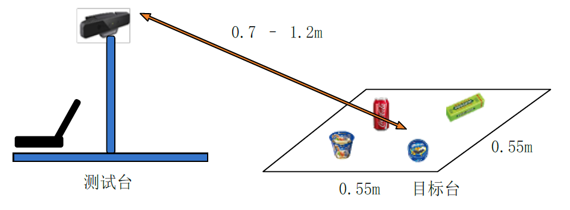
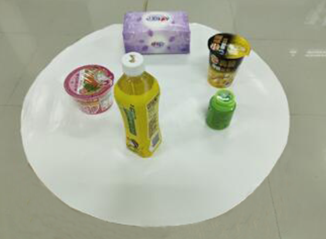
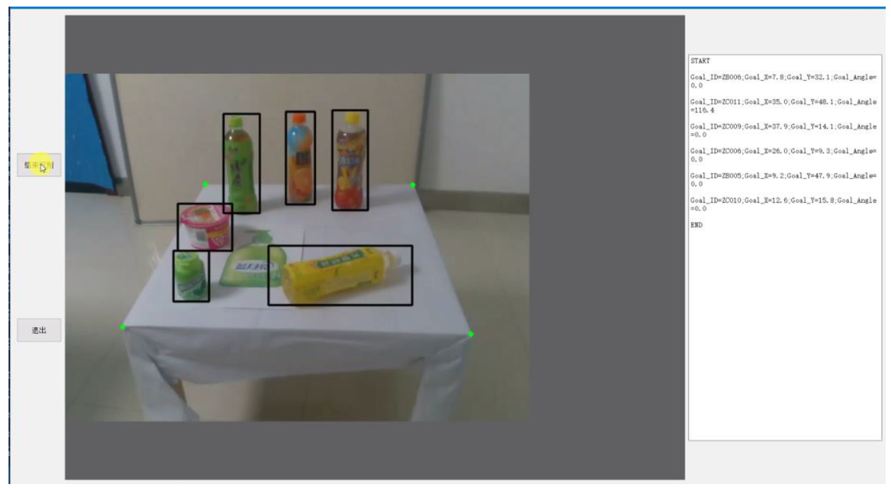
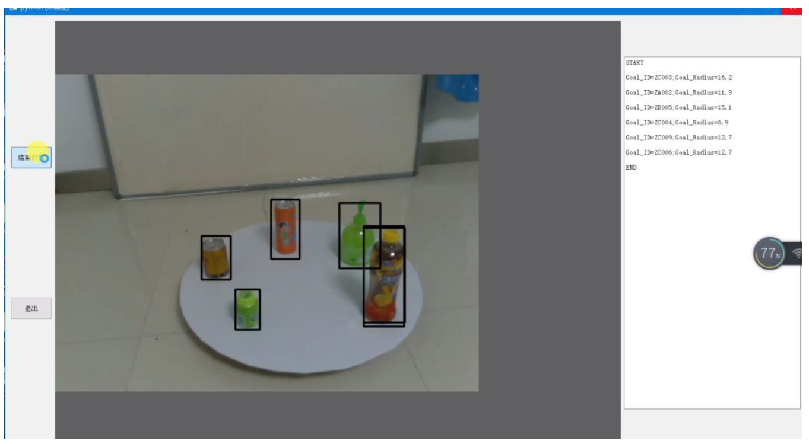

# 2019年中国机器人大赛先进视觉-3D测量项目

## 1. 比赛规则

### 1.1 方桌测量

> 静态测量，使用一张方形目标台，目标台上放置6-12个不同实物（包括不同姿态、旋转和相互遮挡），并存在若干张物品图片的干扰，要求软件进行实物识别和测量，得到每个实物的ID以及坐标和角度。



### 1.2 圆桌测量

> 动态测量，使用一张圆形目标台，目标台上放置6-12个不同实物（包括不同姿态、旋转和相互遮挡），目标台连续匀速旋转，并存在若干张物品图片的干扰，要求软件进行实物识别和测量，得到每个实物的ID以及坐在目标台上投影中心到目标台圆心的距离。



更多详细规则见`2019中国机器人大赛_机器人先进视觉赛_3D测量项目.pdf`

## 2.技术方案

### 2.1 物体识别

​		由于比赛不要求实时识别，所以使用了当时识别效果较好的two stage的[Mask RCNN](https://github.com/matterport/Mask_RCNN)，而不是one stage的Yolo系列的深度学习网络。

​		数据集标注需要标注掩膜，最后自行标注了2000+物品数据集。

### 2.2 方桌测量

+ 寻找桌角：使用传统OpenCV方法时，角点检测检测出来的结果精度低，鲁棒性差。2D方案约束下较好的方式是使用霍夫线及其变体方法，检测方桌的楞（线），然后利用直线的交点求得桌角对应的角点；鲁棒性较高的方法是使用Deep Learning寻找桌角所在的局部小圆。3D方法使用点云可以将桌面完全抠出，但是由于深度相机（Intel Realsense SR300）精度及噪点多，无法得到精确的桌角（也有可能是自己当时太菜）。最后，为了追求鲁棒性，利用深度学习来学习角点特征（虽然神经网络的可解释性差） ，并提取若干角点，然后使用深度相机得到的3维空间下的桌角范围进行约束，得到四个最好的角点。

+ 测量坐标

  利用四个提取的角点和已知边长的正方形桌面的四个固定顶点进行透视变换，利用得到的矩阵可以将原图中的物体前侧点映射到正方形桌面上，利用比例计算出前侧点的坐标位置，然后利用字典加以物体尺寸的修正便可得到最终结果，误差一般在1cm以内，极端情况下也会控制在3cm以内。

+ 测量角度：

  使用最小外接矩形，求得最接近物体的长方形轮廓，然后计算长方形长边与方桌前沿直线的夹角便可得到结果。规则物体测量误差一般在3度左右，不规则物体角度误差大于6度。（更好的方式应该是使用物体掩膜，结合点云，然后求出更为精确的直线或者特征后进行计算，由于当时能力和时间有限，没有完成，此处可有大的提高）

  

### 2.3 圆桌测量

 `圆桌是以圆心为轴匀速旋转，所以可以采取多个周期的识别结果和测量数据进行计算`

+ 获取圆桌圆心坐标：无论圆盘怎样旋转，俯视角度下椭圆的长轴始终等于圆盘直径，测量多个周期内圆盘最左边和最右边的坐标，求平均即可得到圆心坐标。
+ 获取物体坐标：在帧率较高的前提下，我们测量多个周期的物体坐标并不断更新物体最左和最右的坐标（要设置多种约束排除干扰帧），然后和圆心坐标做差并作相关参数调整即可得到至圆心的距离。



## 3.使用方法

+ 安装相关依赖

+ ```python
  # train
  python train.py
  # test
  python test_final.py
  ```

  

